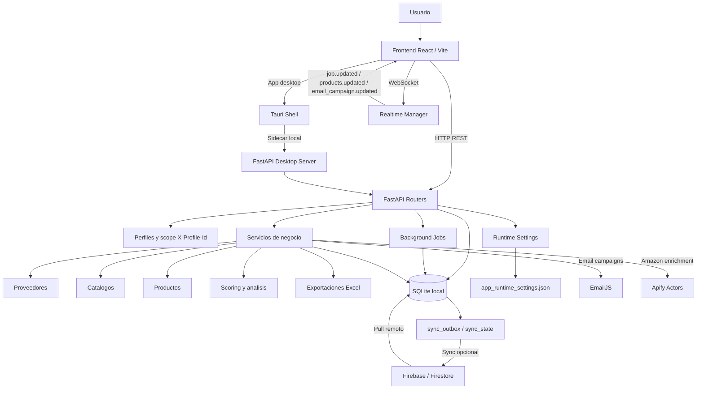

# Arquitectura

## Vista por capas



```text
React/Vite/Tauri UI
        |
        | HTTP, WebSocket
        v
FastAPI routers
        |
        | SQLAlchemy sessions
        v
SQLite local
        |
        | Sync opcional
        v
Firebase/Firestore

Servicios externos:
FastAPI -> Apify
FastAPI -> EmailJS
```

## Backend

Entrada principal:

- `app/main.py`

Responsabilidades:

- Crear tablas SQLite al arrancar.
- Aplicar migraciones ligeras para columnas necesarias.
- Registrar routers.
- Configurar CORS.
- Aplicar rate limiting y logging.
- Ejecutar sincronizacion periodica si Firebase esta habilitado.

Carpetas principales:

| Carpeta | Uso |
| --- | --- |
| `app/routers` | Endpoints FastAPI. |
| `app/models` | Modelos SQLAlchemy. |
| `app/schemas` | Schemas Pydantic. |
| `app/services` | Integraciones y logica de negocio. |
| `app/core` | Configuracion, DB, seguridad, perfiles, sync y errores. |
| `app/utils` | Validadores, mapeo de columnas y calculos auxiliares. |
| `app/tests` | Pruebas automatizadas. |

## Frontend

Entrada principal:

- `frontend/src/main.tsx`
- `frontend/src/App.tsx`

Carpetas principales:

| Carpeta | Uso |
| --- | --- |
| `frontend/src/pages` | Vistas de la aplicacion. |
| `frontend/src/components` | Componentes reutilizables. |
| `frontend/src/api` | Clientes HTTP por modulo. |
| `frontend/src/hooks` | Estado y polling. |
| `frontend/src/contexts` | Contextos globales. |
| `frontend/src/types` | Tipos TypeScript. |

El cliente HTTP agrega `X-Profile-Id` desde `localStorage` cuando existe un perfil activo.

## Base de datos

SQLite es la fuente local principal. Las tablas principales son:

- `user_profiles`
- `suppliers`
- `products`
- `amazon_product_data`
- `product_analyses`
- `email_campaigns`
- `email_logs`
- `background_jobs`
- `sync_outbox`
- `sync_state`

## Trabajos largos

Los procesos que pueden tardar se modelan como jobs en backend:

- Enriquecimiento Apify.
- Analisis de productos.
- Campanas de email.

Esto permite que el frontend cambie de pagina o se recargue y luego consulte el estado desde `/jobs` o `/emails/campaigns`.

## Realtime

El backend expone:

```text
ws://127.0.0.1:8000/ws/realtime
```

Puede recibir `profile_id` como query param. Se usa para emitir eventos de jobs, campanas y cambios de productos.
